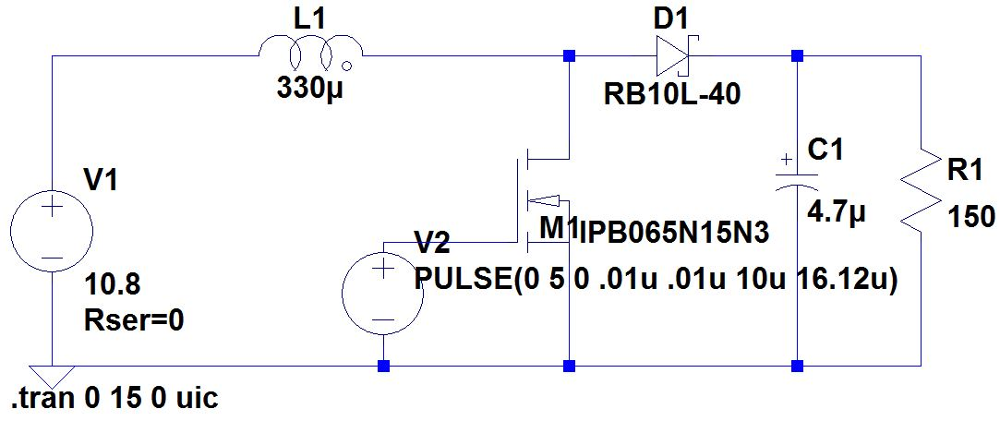
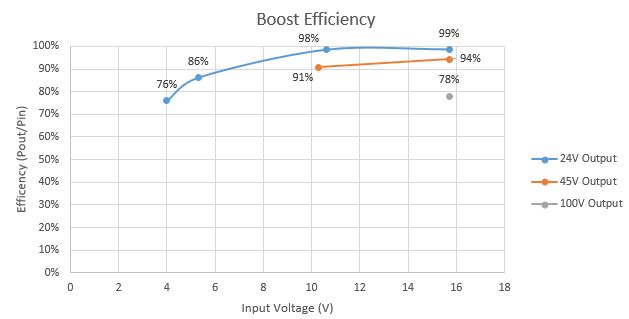

# Arduino-Boost-Converter
Basic 2A, 10W DC-DC boost converter using the Arduino platform. 

Please follow the complete guide here for much more information:

http://mcuhq.com/29/arduino-dc-dc-boost-converter-design-circuit-with-control-loop

## Introduction

This circuit can safely boost a lower voltage input to a higher output voltage. The arduino is used as a controller to regulate the output to a desired setpoint. The limits of operation are as follows:

 - Max input voltage: 100V
 - Max input current: 2A

 I only tested this circuit up to 15W output. 

 An isolated supply with current limiting capability is encouraged for resting. A simply DC power brick with an in-line fuse will also suffice for safety.

 High efficiencies are attainable at lower voltage deltas. 

## Required Tools

These are the parts I used, however please note that digikey stock fluctuates over the years and so the exact model shown does not need to be used.

| RefDes   |   Digkey | Description |
|----------|:-------------:|------:|
| L1 | [811-1335-ND](https://www.digikey.com/product-detail/en/murata-power-solutions-inc/1433428C/811-1335-ND/1924824) | IND 330UH 2.8A 150 MOHM |
| Q1 |  [IRLI640GPBF-ND](https://www.digikey.com/product-detail/en/vishay-siliconix/IRLI640GPBF/IRLI640GPBF-ND/812191)  | MOSFET N-CH 200V 9.9A TO220FP |
| D1 |   [497-3216-1-ND](https://www.digikey.com/product-detail/en/stmicroelectronics/STPS3150RL/497-3216-1-ND/654568)  | DIODE SCHOTTKY 150V 3A |
| C1 | 	[493-1164-ND](https://www.digikey.com/product-detail/en/nichicon/UVR2C470MHD/493-1164-ND/588905)  |  CAP ALUM 47UF 20% 160V RADIAL |
| R1 |  [150W-5-ND](http://www.digikey.com/product-detail/en/yageo/SQP500JB-150R/150W-5-ND/18683) | 	RES 150 OHM 5W 5% AXIAL|

You will also need an Arduino Uno board, its IDE, and a voltmeter to verify the voltage.

## Setup

1. Construct the circuit
2. Connect the Arudino with a USB to a computer. Program the Arduino with the default settings.
3. Run the COM port debugger through the Arduino IDE to see the debug data. 
4. Place a voltmeter or oscope onto the ADC feedback pin, input pin, and output pin. 
5. Adjust the PID constans as outline in the article until a stable output is achieved (easier said than done!).

## Issues

Please submit all issues to the github tracker. Pull requests are also encouraged. General comments can be left at [mcuhq.com](http://mcuhq.com/29/arduino-dc-dc-boost-converter-design-circuit-with-control-loop)